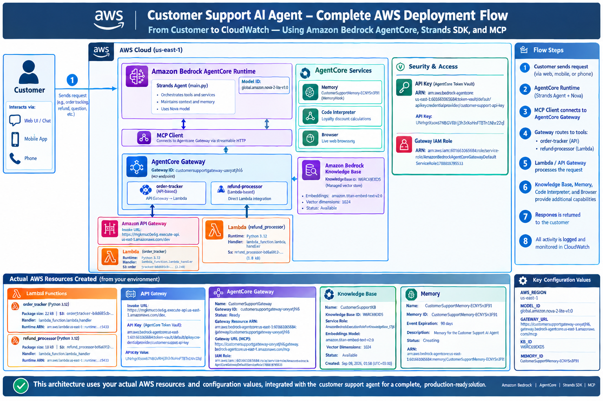

# Architecture

## End-to-end request path

1. Customer submits a natural-language support request.
2. Amazon Bedrock model reasoning is hosted through the AgentCore Runtime / Strands agent.
3. The Strands agent uses MCP to connect to `CustomerSupportGateway`.
4. Gateway routes transactional work to the correct target:
   - `order-tracker` through API Gateway REST proxy → Lambda.
   - `refund-processor` directly → Lambda.
5. The agent can also call:
   - `CustomerSupportKB` for grounded RAG.
   - `CustomerSupportMemory` for cross-session customer context.
   - AgentCore Code Interpreter for exact loyalty arithmetic.
   - AgentCore Browser for live web access.
6. CloudWatch provides runtime logging/monitoring and the rubric-required error alarm.
7. The response is returned to the customer.

## Actual resources

See `docs/AWS_RESOURCE_MANIFEST.md` for the resource identifiers supplied from the deployed AWS environment.
